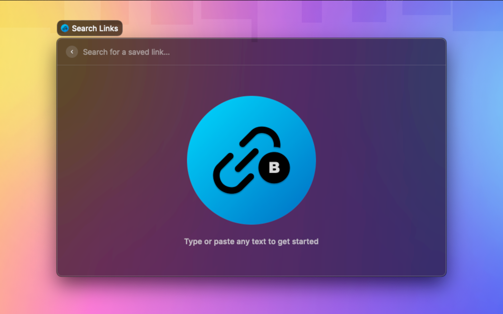
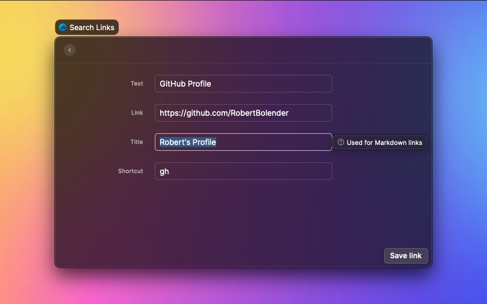
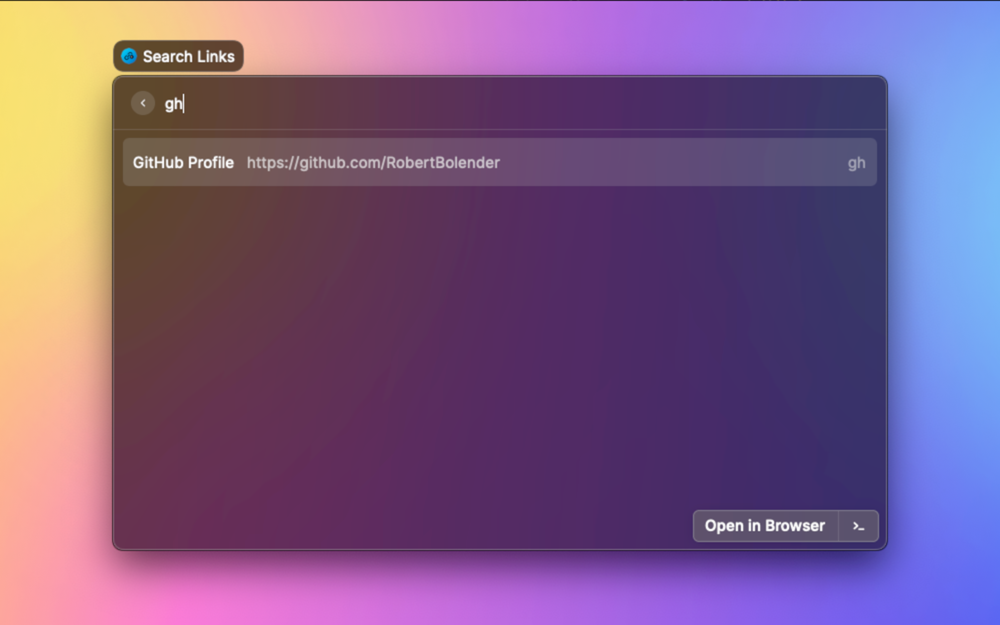

# Raycast extension for BlitLink

Quickly store and retrieve links for future reference.  
Be the fastest to respond in Slack with the perfect relevant link or reaction GIF.

Reasons to use this extension instead of the built-in Quicklinks:

- You can copy links as either plain URLs or as markdown links (e.g.: `[title](url)`)
    - `cmd+u` to copy the plain URL
    - `cmd+l` to copy the Markdown link
- You can preview images (memes) within Raycast before sharing
    - `enter` to preview the image and copy the plain URL to the clipboard
- You are me and you want to experiment with building your own Raycast Extension

Notes:

- Uses a local SQLite database.
- Assumes a copy of `sqlite3` is present in the PATH.
- `sqlite3` is installed by default on modern versions of MacOS.

